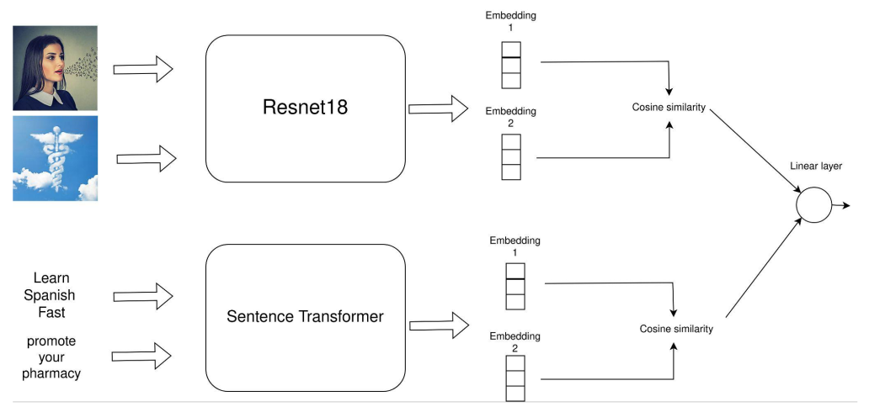
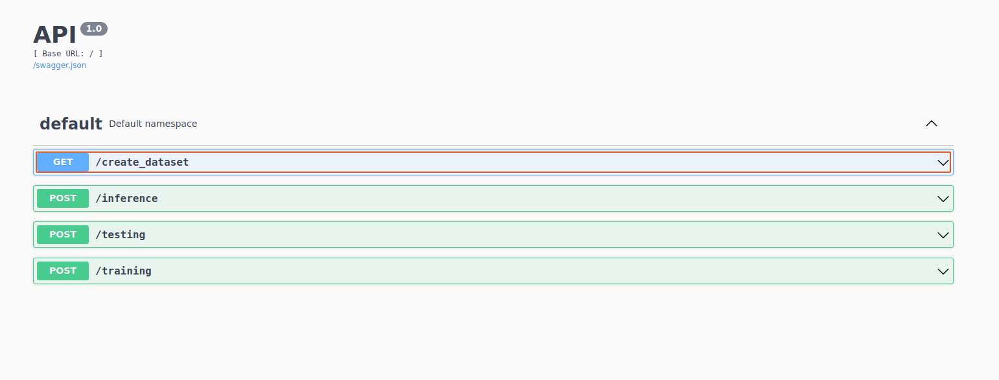
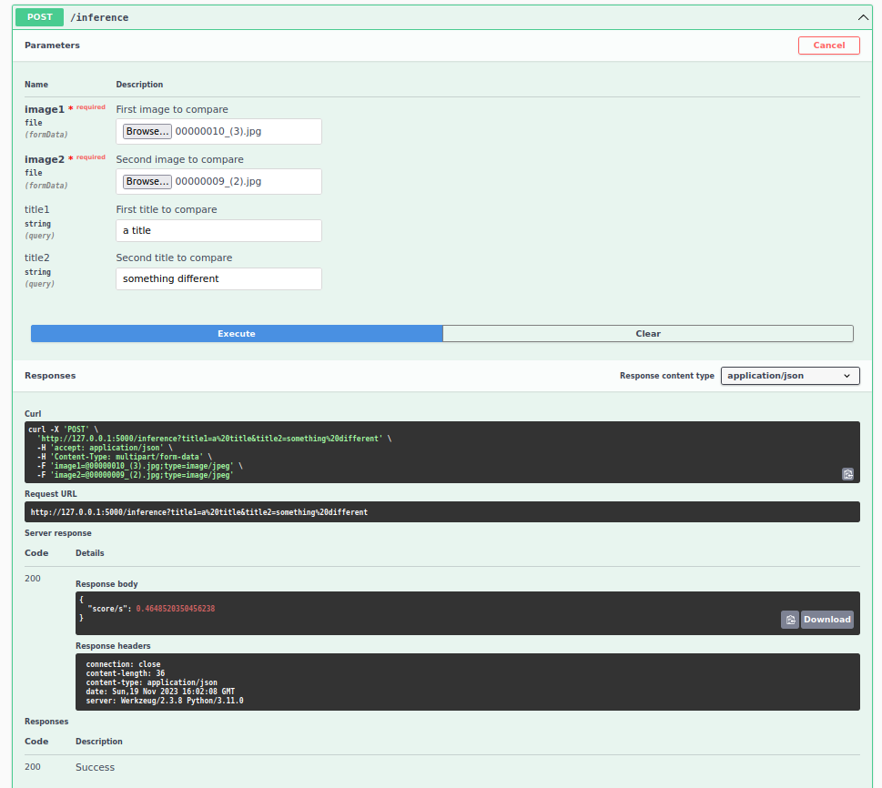

# Multimodal siamese neural network for similarity detection between (image, text) pairs

This repository includes code designed to identify duplicates within pairs of (image, text).  
The modalities are handled by pre-trained CNN and sentence transformer models, respectively.  
The output is a similarity score ranging from 0 to 1, indicating the level of similarity.  

## Running

**Step 0**

This module is developed with python==3.11.0

**Step 1**

Clone the Repository:
   ``
   git clone https://bitbucket.org/deeplabdeduplication/deduplication``

**Step 2**

Create a Virtual Environment and Install Requirements:

`` cd your-repository``

`` conda create --name ENV_NAME python==3.11.0``

``pip install -r requirements.txt``

**Step 3**

Install local jupyter inside the conda environment:

`` conda install jupyter``

**Step 4**

Prepare the Dataset Folder, as follows:
<pre>
Dataset/
    images/..
    data.txt
</pre>

**Step 5**

Create a model file (for model storage) as follows:
<pre>
src/model/
</pre>

**Step 6**

Configure Paths in `constants.py`:

Add the paths to the dataset folder and the model folder.

**Step 7**

Run the API:

`` run python3 api.py``

**Step 8 (Optional)**

To ensure everything is setup correctly and all endpoints work you can run:

`` run python3 unittests.py``

## Usage

### API

The API is integrated with Swagger, allowing you to interact with its endpoints visually.

If everything is set up correctly, you should see the Swagger UI at your localhost:

This interface makes it easy to utilize all the endpoints for training, testing, and inference.

Here's an example of an inference:

In this interface, you can manually select two (image, title) pairs and perform an inference to determine similarity.

### Notebook

One can also interact with the notebook provided inside `src` folder to optimize model architecture and/or training parameters.
